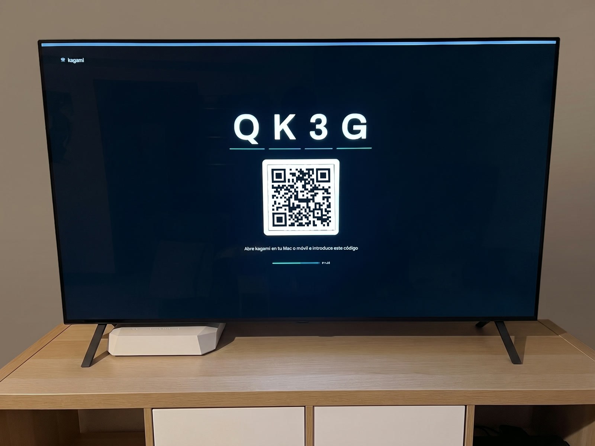
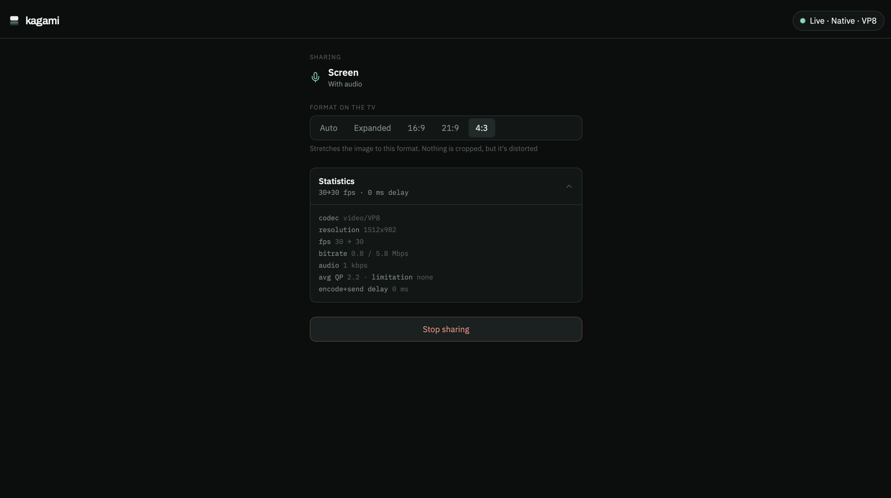
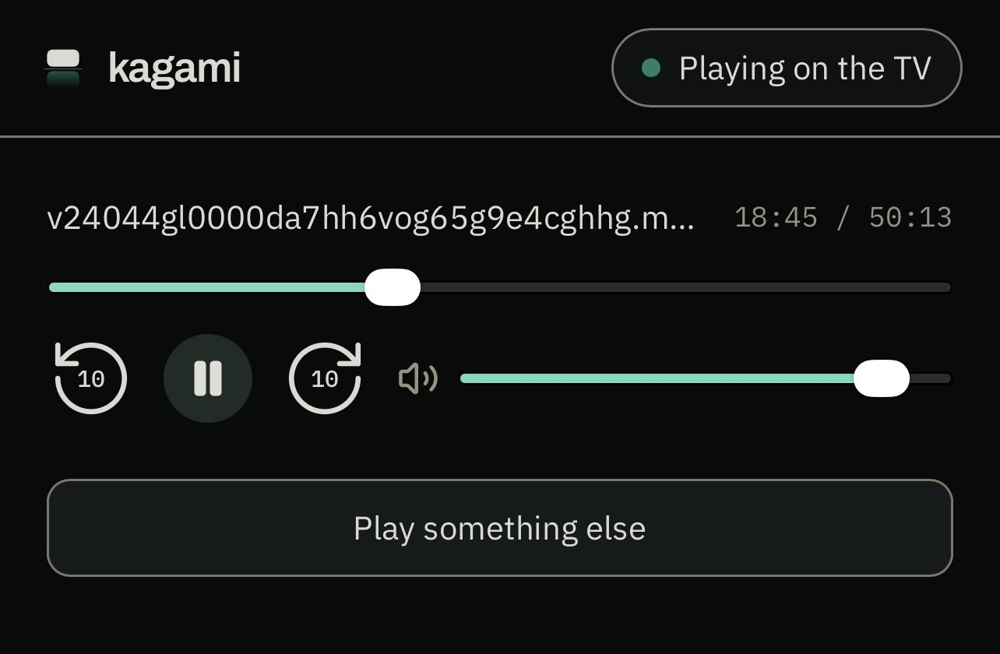

<div align="center">


### Screen mirroring and casting for any TV with a browser

Self-hosted. No cables, no store apps, no accounts.
**210 ms measured latency** on a home network.

[](LICENSE)
[](https://nodejs.org)
[](#quick-start)
[](#how-it-works)

</div>

<!-- ══════════════════════════════════════════════════════════════════
     IMAGEN 1 · HERO  ·  docs/media/hero.jpg  ·  1600px de ancho
     La tele mostrando el codigo de sala grande y el QR.
     Foto del salon, no captura de pantalla — JPEG, no PNG: una foto
     real pesa entre 15 y 30 veces menos como JPEG que como PNG sin
     perdida, y a esta resolucion la diferencia no se nota a ojo.
     ══════════════════════════════════════════════════════════════════ -->


<br>

**kagami** (鏡) means *mirror*. Open it on your TV, get a four-character code,
type that code on your laptop or phone — and your screen is on the TV.

The video travels **peer-to-peer across your own network**. The server
introduces the two devices and then gets out of the way. Nothing leaves your
house, nothing touches a cloud, and there is no account to create.

<br>

## The honest summary

Most projects bury this in an issue tracker. Here it is in the second screenful,
because knowing what a tool *won't* do is worth more than a feature list.

| What kagami does | What kagami does not do |
|---|---|
| Mirror a desktop screen, window or tab to any TV with a browser | Mirror an iPhone or iPad screen — **iOS forbids it to every web app** |
| Cast a video link, played natively by the TV | Play Netflix, Prime or Disney+ — **DRM blocks capture by design** |
| Cast a local file with instant seeking, even a 1.5 GB film | Play YouTube links — a web page is not a video file |
| Feed several screens at once, from one device | Work over the open internet — it is LAN-first, use a VPN |
| Run on one container, with no database and no accounts | Reshape the picture on TVs that decode H.264 in hardware |

<br>

> [!IMPORTANT]
> **iPhone and iPad cannot mirror their screen. This is not a kagami
> limitation.** iOS does not expose the system screen to any web page — that
> capability belongs to AirPlay and nothing else. What kagami offers instead is
> casting, which for *playing content on a TV* is genuinely the better tool:
> full quality, real seeking, and you can lock your phone without stopping
> playback.

> [!WARNING]
> **Mirroring a streaming service shows a black rectangle.** Netflix, Prime,
> Disney+ and friends block screen capture through DRM. That is the DRM working
> exactly as designed, and no screen-sharing tool on earth gets around it. Use
> the TV's own apps for that content — kagami's sender says so before you try.

<br>

## What it does, properly

### Mirror your desktop

Share a full screen, a single window or one tab from any desktop browser. On a
wired network this runs at **native resolution with 210 ms of measured
end-to-end latency** — fast enough to present from, and fast enough that you
notice it's fast.

<!-- ══════════════════════════════════════════════════════════════════
     IMAGEN 2 · EL EMISOR  ·  docs/media/mirror.png  ·  1400×900
     El portatil compartiendo: pildora de estado, selector de formato,
     y el desplegable de estadisticas ABIERTO para que se vean los datos.
     ══════════════════════════════════════════════════════════════════ -->


### Cast a link

Paste a direct video URL. The TV plays it with its own decoder, at full quality,
while play, pause, seek and volume stay on your phone. Lock the phone and the
film keeps going — and when you unlock it, the remote is still yours.

### Cast a file

Pick a video or photo from your phone or computer. It uploads to **your** server
and the TV streams it from there with real range requests, which is what makes
seeking instant even on a 1.5 GB film. When the room closes, the file is
deleted — and a 24-hour sweep that survives a restart catches anything that
slips through.

<!-- ══════════════════════════════════════════════════════════════════
     IMAGEN 3 · CAST DESDE EL MOVIL  ·  docs/media/cast-phone.jpg
     El iPhone con un cast en marcha y los controles.
     ══════════════════════════════════════════════════════════════════ -->


### Several screens at once

One sender can feed more than one screen, and independent rooms run side by
side. One kagami, every screen in the house.

<br>

## Measured, not estimated

Every number below came from a real session on a real television, not from a
benchmark or an estimate. The reasoning behind each one — including the two
diagnoses that turned out to be wrong — is in [`docs/`](docs/).

| | Measured |
|---|---|
| **End-to-end mirror latency** | **210 ms** · single sample, LAN, VP8 |
| **Continuous run without a cut** | **15+ minutes** · 0 packets lost, 0 PLI, 0 NACK |
| **Frame rate at native resolution** | **26 of 26** source frames encoded |
| **Largest file cast** | **2.6 GB** · repeated mid-film seeks, near-instant |
| **Signalling round trip** | **4 ms** |

> [!NOTE]
> Zero PLI over fifteen minutes is the number that matters: it means the
> television's decoder never once had to ask for a keyframe. Early builds
> stuttered badly, and finding out why took four rounds of measurement.

<br>

## Quick start

```bash
git clone https://github.com/FranParedesNavarrete/kagami.git && cd kagami
docker compose up -d
```

1. **On the TV** — open `http://<your-server>:7421`, press **Show code**, and a
   four-character code appears with a QR beside it.
2. **On your laptop or phone** — open the same address over HTTPS, type the code
   (or scan the QR), and share.

One container. No database, no Redis, no message broker. Rooms live in memory,
and a restart simply clears them — which is the correct behaviour for something
this ephemeral.

<details>
<summary><b>Putting it behind a reverse proxy</b></summary>

<br>

Screen capture requires a secure context, so **senders must arrive over HTTPS**.
The TV is different: its side of the app uses no API that needs a secure
context, so the screen view is served over plain HTTP on the same port and the
television never has to trust a certificate.

With Caddy and an internal CA:

```caddyfile
kagami.example.com {
    reverse_proxy 127.0.0.1:7421
}

http://screen.example.com {
    reverse_proxy 127.0.0.1:7421
}
```

Point the TV at the plain-HTTP hostname and every other device at the HTTPS one.

</details>

<br>

## Browser support

The screen side only needs a browser that decodes H.264 or VP8. Verified on
webOS (LG); other smart TVs are likely fine but unverified.

For senders:

| Browser | Mirroring | System audio | Notes |
|---|---|---|---|
| **Chrome** | Full resolution | Direct | Recommended. Every measurement above was taken here. |
| **Edge** | Full resolution | Direct | Same engine as Chrome. Not verified. |
| **Safari** | Half resolution | Needs a virtual device | See [audio on Safari and Firefox](#audio-on-safari-and-firefox). |
| **Firefox** | Untested | Needs a virtual device | Should work. Nobody has checked. |
| **Brave** | Does not encode | — | Fails with Shields on. Disable them for the site. |

<br>

## Supported formats

**Files you upload** — `mp4`, `m4v`, `mov`, `webm` for video; `jpg`, `png`,
`gif`, `webp` for images.

**Links you paste** — the same video formats plus `m3u8` (HLS), fetched by the
television directly from the source.

This list comes from what the tested televisions actually play, not from what
the specifications say they should. Matroska (`.mkv`) is deliberately absent:
no browser plays it reliably.

> [!TIP]
> kagami rejects an unsupported file **before the upload starts**, not after a
> gigabyte has crossed your network and the TV has failed to decode it.

<br>

## Configuration

| Variable | Default | What it does |
|---|---|---|
| `KAGAMI_PORT` | `7421` | HTTP port. Bind it to `127.0.0.1` behind a proxy. |
| `KAGAMI_CAST_MAX_MB` | `4096` | Maximum size of an uploaded cast file. |
| `KAGAMI_REMUX_FASTSTART` | `false` | Rewrites uploads whose `moov` atom sits at the end of the file. |

That is the entire configuration.

<details>
<summary><b>Why <code>KAGAMI_REMUX_FASTSTART</code> is off by default</b></summary>

<br>

An MP4 whose `moov` atom lives at the end of the file is the classic reason
seeking fails: the player has to reach the tail before it knows where anything
is. The usual fix is to remux the file so the atom comes first.

We measured what the television actually does, and it fetches the last 75 KB
with one extra range request and carries on. So remuxing a 2 GB upload would
cost minutes of waiting and twice the disk to solve a problem that isn't there.

The code stays, behind this flag, for receivers that do need it. The full
request trace is in [`docs/spike-range.md`](docs/spike-range.md).

</details>

<br>

## Audio on Safari and Firefox

Chrome captures system audio directly. Safari and Firefox cannot — a browser
limitation, not a kagami one. The workaround is a virtual audio device.

<details>
<summary><b>Setting up BlackHole on macOS</b></summary>

<br>

1. Install [BlackHole](https://existential.audio/blackhole/) and reboot:
   ```bash
   brew install blackhole-2ch
   ```
2. Open **Audio MIDI Setup** and create a *Multi-Output Device* containing both
   BlackHole 2ch and your speakers, with drift correction enabled on BlackHole.
3. Set that Multi-Output Device as your system output.
4. In kagami, choose **Input device → BlackHole 2ch** as the audio source.

Your Mac plays through the speakers as usual, and kagami captures the same
signal on its way past.

Two things worth knowing. The Mac's own volume no longer changes what the TV
hears — BlackHole taps the signal before the system volume stage, so the keys
do nothing to the stream. Use kagami's volume slider, or the television's own
volume. And the Multi-Output Device never appears in kagami's picker: that
list shows inputs, and BlackHole is the input half of the pair.

</details>

<br>

## How it works

The server (Fastify + WebSocket) serves the pages and relays the WebRTC
handshake between sender and screen. **The media itself flows directly between
the two devices** — on a local network that means minimal latency and no load
on the server at all. No STUN, no TURN: host candidates are enough when both
devices can see each other.

File casting is the one deliberate exception. The server holds the file
temporarily so the television can stream it with its own native decoder and real
range requests — which is what makes seeking work, and what makes it work from a
phone at all.

<br>

## Security

- **Nothing listens outside `127.0.0.1`** in the production compose file. Your
  reverse proxy is the only door.
- **Room codes** are four characters from a 27-character alphabet with no
  visually ambiguous glyphs — they get read across a room. Single use, expiring
  after ten minutes unpaired. A paired room accepts no second sender.
- **Uploads** are size-limited, validated *by content rather than by file
  extension*, isolated per room, served only to the room that uploaded them, and
  deleted when that room closes.
- **No accounts, no personal data, no telemetry.** There is nothing to export
  and nothing to leak.

<br>

## Development

```bash
pnpm install
pnpm run dev     # server + web, hot reload
pnpm run test    # unit and integration
pnpm run e2e     # Playwright against the real server
```

TypeScript throughout, Node 22, pnpm workspaces: `apps/server`, `apps/web`,
`packages/shared`. Every message crossing the WebSocket is validated with zod on
both ends.

Anything that requires a physical television is documented as a pending human
check and **never simulated** — a test that fakes the TV is a test that lies.
That rule caught three real bugs that a green suite had been hiding.

See [`CODESTYLE.md`](CODESTYLE.md) before contributing, and [`docs/`](docs/) for
the measurements behind every decision — including the ones that turned out to
be wrong, which are kept rather than deleted.

<br>

## Why it exists

A living-room OLED advertised full AirPlay support and never quite delivered it.
The choice was a three-metre HDMI cable or a better idea. kagami is the better
idea, and it turned out to work on every device in the house rather than just
the Apple ones.

<br>

## License

MIT. Use it, fork it, ship it.
