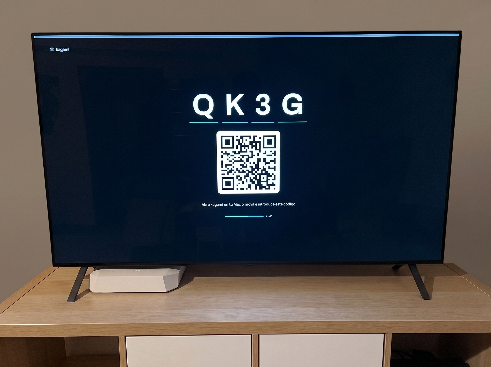

# kagami

Screen mirroring and casting for any TV with a browser. Self-hosted. No cables, no store apps, no accounts.

**License:** MIT · **Runtime:** Node 22 · **Deploy:** Docker

<!-- IMAGEN 1 · hero
Foto o captura de la tele mostrando el codigo de sala grande + QR. 1600x900, PNG.
Si es foto del salon, mejor que captura: vende mas.
Guardar en docs/media/hero.png -->


kagami (鏡) means mirror. Open it on your TV, get a four-character code, type that code on your laptop or phone — and your screen is on the TV.

The video travels peer-to-peer over your own network. The server only introduces the two devices and then gets out of the way. Nothing leaves your house, nothing touches a cloud, and there is no account to create.

## What it does

**Mirror your desktop.** Share a full screen, a single window or one tab from any desktop browser. On a wired LAN this runs at native resolution with measured 210 ms of end-to-end latency — fast enough to present from, and to notice that it's fast.

**Cast a link.** Paste a direct video URL and the TV plays it natively, at full quality, while you keep play, pause, seek and volume on your phone.

**Cast a file.** Pick a video or photo from your phone or computer. It uploads to your own server and the TV streams it from there — so seeking is instant even on a 2 GB film, and you can lock your phone without stopping playback.

**Several screens at once.** One sender can feed more than one screen, and independent rooms can run side by side. One kagami, every screen in the house.

<!-- IMAGEN 2 · el emisor compartiendo
Captura del portatil mientras comparte: pildora de estado, formato en la tele,
y el desplegable de estadisticas abierto para que se vean los datos.
1400x900, PNG. Guardar en docs/media/mirror.png -->


## What it honestly does not do

This section exists because most projects put it in an issue tracker instead.

- **No full-screen mirroring from iPhone or iPad.** iOS does not expose the system screen to any web page — that is AirPlay's exclusive, and no web app can work around it. Cast covers the real use case: playing content on the TV, where it is actually better than mirroring.
- **No DRM content.** Mirroring Netflix, Prime or Disney+ produces a black rectangle. That is DRM working as designed, not a bug. Use the TV's own apps.
- **No YouTube links.** A YouTube page is a web page, not a video file. Your TV almost certainly has a YouTube app that does this better, in 4K, for free.
- **No internet relay.** kagami is LAN-first by design. For use away from home, put it behind your VPN — it works over Tailscale out of the box.
- **Aspect modes only apply to VP8 mirroring.** Many TVs decode H.264 in a hardware overlay plane that the page's CSS cannot reach. Measured on an LG OLED; see docs/webrtc-codec.md.

## Measured, not estimated

Every number here was taken from a real session on a real TV, not from a benchmark or a guess. The reasoning behind each one is in docs/.

| | Measured |
|---|---|
| End-to-end mirror latency | 210 ms (single sample, LAN, VP8) |
| Continuous run without a cut | 15+ min, 0 packets lost, 0 PLI, 0 NACK |
| Frame rate at native resolution | 26 of 26 source frames encoded |
| Largest file cast | 1.5 GB, seeking instant |
| Signalling round trip | 4 ms |

## Browser support

| Sender | Mirror | System audio | Notes |
|---|---|---|---|
| Chrome / Edge | Full resolution | Yes | Recommended. Everything above was measured here. |
| Safari | Half resolution | Via a virtual device | Needs BlackHole to send system audio. |
| Firefox | Untested | Via a virtual device | Should work; nobody has verified it. |
| Brave | Broken | — | Fails to encode with Shields on. Disable them for the site. |

The screen side only needs a browser that can decode H.264 or VP8. Verified on webOS (LG); other smart TVs are likely fine but unverified.

## Quick start

```bash
git clone <repo> kagami && cd kagami
docker compose up -d
```

On the TV: open `http://<your-server>:7421` → **Be the screen** → a code appears.
On your laptop or phone: open the same address over HTTPS, type the code, share.

One container. No database, no Redis, no message broker. Rooms live in memory and a restart simply clears them, which is the correct behaviour for something this ephemeral.

## Behind a reverse proxy

Screen capture requires a secure context, so senders must arrive over HTTPS. The TV is different: its side uses no API that needs a secure context, so the screen view is served over plain HTTP on the same port and the TV never needs to trust a certificate.

With Caddy and an internal CA:

```caddyfile
kagami.example.com {
    reverse_proxy 127.0.0.1:7421
}

http://screen.example.com {
    reverse_proxy 127.0.0.1:7421
}
```

## Configuration

| Variable | Default | What it does |
|---|---|---|
| `KAGAMI_PORT` | `7421` | HTTP port. Bind it to 127.0.0.1 behind a proxy. |
| `KAGAMI_CAST_MAX_MB` | `4096` | Maximum size of an uploaded cast file. |
| `KAGAMI_REMUX_FASTSTART` | `false` | Rewrites uploads whose moov atom sits at the end. Off by default: the TVs tested fetch the tail with one extra range request, so remuxing a 2 GB file would cost minutes and twice the disk to fix something that is not broken. Turn it on for a receiver that needs it. |

That is the entire configuration.

## Supported formats for casting

mp4, webm, mov, m3u8 for video; jpg, png, webp for images.

This list comes from what the tested TVs actually play, not from what the specs say they should. Matroska (.mkv) is deliberately absent: no browser plays it reliably. kagami rejects unsupported files before the upload starts, rather than after a gigabyte has crossed your network.

## Audio on Safari and Firefox

Chrome can capture system audio directly. Safari and Firefox cannot — that is a browser limitation, not a kagami one. The workaround is a virtual audio device:

1. Install BlackHole (`brew install blackhole-2ch`) and reboot.
2. In Audio MIDI Setup, create a Multi-Output Device with BlackHole and your speakers, with drift correction enabled on BlackHole.
3. Set that device as your system output, and pick BlackHole 2ch as the audio source in kagami.

Your Mac plays through the speakers as usual and kagami captures the same signal. Note that the Multi-Output Device itself never appears in kagami's picker — that list shows inputs, and BlackHole is the input half of the pair.

<!-- IMAGEN 3 · cast desde el movil
Captura del iPhone con el cast de fichero en marcha: controles y barra de tiempo.
Vertical, ~900x1600, PNG. Guardar en docs/media/cast-phone.png -->

## How it works

The server (Fastify + WebSocket) serves the pages and relays the WebRTC handshake between sender and screen. The media itself flows directly between the two devices — on a LAN that means minimal latency and no load on the server at all. No STUN, no TURN: host candidates are enough when both devices can see each other.

The one exception is file casting, and it is deliberate. The server holds the file temporarily so the TV can stream it with its own native decoder and real range requests, which is what makes seeking work and what makes it work from an iPhone at all.

## Security

- Nothing listens outside 127.0.0.1 in the production compose file. Your reverse proxy is the only door.
- Room codes are four characters from a 27-character alphabet with no visually ambiguous glyphs, single-use, expiring after ten minutes unpaired. A paired room accepts no second sender.
- Uploads are size-limited, validated by content rather than by file extension, isolated per room, served only to the room that uploaded them, and deleted when the room closes — with a 24-hour sweep that survives a server restart as a second line of defence.
- No accounts, no personal data, no telemetry. There is nothing to export and nothing to leak.

## Development

```bash
pnpm install
pnpm run dev          # server + web, hot reload
pnpm run test         # unit and integration
pnpm run e2e          # Playwright against the real server
```

TypeScript throughout, Node 22, pnpm workspaces: apps/server, apps/web, packages/shared. Every message crossing the WebSocket is validated with zod on both ends. Anything that requires a physical TV is documented as a pending human check and never simulated — a test that fakes the television is a test that lies.

See CODESTYLE.md before contributing, and docs/ for the measurements behind every decision, including the ones that turned out to be wrong.

## License

MIT. Use it, fork it, ship it.
